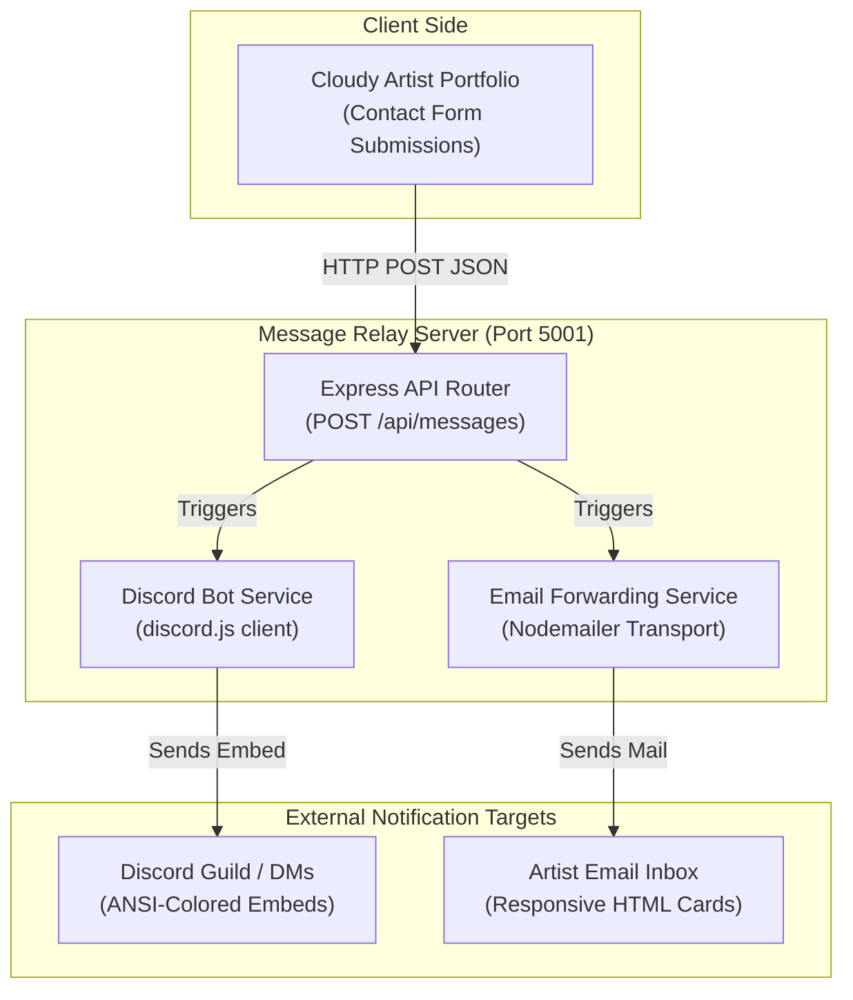

# Cloudy Message Relay & Discord Bot

A standalone Node.js & TypeScript microservice that acts as an Express HTTP API, a Discord bot client, and an SMTP email forwarder. It receives contact form submissions from the **Cloudy Artist Portfolio** website and relays them directly to:
1. **Discord**: Posts a styled, rich embed with the message details to a specific channel (with optional developer/artist pings).
2. **Email**: Forwards the submission as a clean, responsive HTML email to the artist's configured address.

---

## Architecture & Flow

The message relay service operates as a decoupled gateway. The diagram below illustrates how client submissions are handled and routed:



- **Service Boot**: During initialization, the Discord Bot connects to the gateway and the SMTP Mail Server connection is validated using Nodemailer.
- **Payload Validation**: The Express router ensures that the request body contains a name, message, and at least one contact channel (email or Discord ID).

---

## Tech Stack
- **Runtime**: Node.js (with ECMAScript Modules)
- **Language**: TypeScript
- **HTTP Server**: Express
- **Discord Bot client**: `discord.js`
- **Email Forwarder**: `nodemailer`
- **Development runner**: `tsx`

---

## Project Structure

```
src/
├── app.ts                 # Express application definition, global middleware, & route mounting
├── server.ts              # Service bootstrap entry point, global error handling, & graceful shutdown
├── config.ts              # Type-safe environment variables validation & logging
├── routes.ts              # API route definitions and controller bindings
├── controllers/
│   └── messageController.ts # POST /api/messages handler: coordinates service dispatching & responses
├── services/
│   ├── discordService.ts  # Singleton managing Discord client bot connection & embeds
│   └── emailService.ts    # Singleton managing SMTP transporter pools & HTML template rendering
├── middleware/
│   ├── errorHandler.ts    # Centralized global Express error interceptor returning unified JSON response
│   └── rateLimiter.ts     # In-memory IP-based rate limiting to protect endpoints from spam
├── errors/
│   └── AppError.ts        # Custom operational error classes (ValidationError, ConfigurationError, RelayError)
├── utils/
│   └── logger.ts          # Structured level-based console logging utility with timestamps & colors
└── types/
    └── index.ts           # Shared TypeScript type definitions
```

---

## Setup & Configuration

### 1. Install Dependencies
Navigate into this directory and run:
```bash
npm install
```

### 2. Configure Environment Variables
Copy `.env.example` to `.env`:
```bash
cp .env.example .env
```
Open `.env` and fill out the fields:

#### Discord Bot Setup
1. Go to the [Discord Developer Portal](https://discord.com/developers/applications).
2. Create a **New Application** and click the **Bot** tab.
3. Click **Reset Token** and copy the bot token into `DISCORD_BOT_TOKEN`.
4. Turn on the **Guild Members Intent** and **Message Content Intent** under the Bot's Privileged Gateway Intents section.
5. Invite the bot to your Discord Server using the OAuth2 URL Generator (select `bot` scope and permissions: `Send Messages`, `Embed Links`).
6. Right-click the channel in Discord where you want messages posted and select **Copy Channel ID**. Paste it into `DISCORD_NOTIFICATION_CHANNEL_ID`.
7. (Optional) Right-click your own profile in Discord and click **Copy User ID**. Paste it into `DISCORD_ARTIST_USER_ID` to receive pings.

#### Email SMTP Setup
Configure your SMTP settings under the `SMTP_*` variables:
- **Gmail**: If using Gmail, set `SMTP_HOST=smtp.gmail.com` and `SMTP_PORT=587`. You **must** generate and use an **App Password** (not your regular account password). Under your Google Account > Security > 2-Step Verification > App passwords, create one for "Other (Custom name)".
- Set `ARTIST_EMAIL` to the target address where you want to receive the messages.

---

## Running the Server

### Development Mode (with hot-reloading)
```bash
npm run dev
```

### Production Build & Start
```bash
npm run build
```
```bash
npm start
```

Once running, the server will expose:
- `POST /api/messages` - Main contact submission relay endpoint.
- `GET /api/health` - Basic health check confirming loaded integrations.

---


### Client-IP and rate limiting

The relay rate-limits per client, and resolving *which* client is a security
control: forwarding headers are believed only when the socket peer is a trusted
proxy. Behind the Cloudflare Tunnel that is `cloudflared` on loopback, and
`CF-Connecting-IP` is authoritative because Cloudflare's edge always overwrites
it.

| Variable | Default | Purpose |
|---|---|---|
| `TRUSTED_PROXIES` | `loopback` | Peers allowed to assert a client address. Accepts `loopback`, `private`, bare IPs, or CIDR blocks. |
| `CLIENT_IP_SOURCE` | `auto` | `auto` prefers `CF-Connecting-IP` then `X-Forwarded-For`; also `cloudflare`, `xff`, `socket`. |
| `TRUST_PROXY` | `1` | Proxy hops, for the `X-Forwarded-For` fallback only. |
| `RATE_LIMIT_MAX` | `5` | Requests allowed per window. |
| `RATE_LIMIT_WINDOW_MS` | `60000` | Window length in milliseconds. |

This holds only while the origin is reachable *exclusively* through the tunnel.
If the app is ever also exposed on a public port, `CF-Connecting-IP` becomes
forgeable by anyone reaching that port directly.

`src/utils/clientIp.ts` is mirrored byte-for-byte in the Admin API. Diff the two
before changing either.

### Message limits

Each field is capped, so an oversized message is rejected with a 400 naming the
field rather than being half-delivered (Discord rejects an embed description over
4,096 characters):

`name` 100 · `email` 254 · `discordId` 100 · `preferredContact` 40 ·
`subject` 200 · `message` 3000

## Testing

```bash
npm test          # vitest, 46 tests
npm run lint
```

Credentials are blanked in `tests/setup.ts`, so both channels report themselves
disabled and **no test can deliver to a real Discord channel or inbox**. Coverage
spans the sanitisers, client-IP resolution across topologies (tunnel, direct
exposure, same-host proxy, local), field limits, endpoint behaviour, and the rate
limiter — including the header-rotation bypass it was originally vulnerable to.

## Local development

Use `../dev-env.sh` from the repository root to run MongoDB, the Admin API and
this relay together on localhost with all outbound credentials blanked:

```bash
./dev-env.sh start    # also: stop | status | seed | logs
```

## Connecting with the Portfolio
The portfolio is configured to use the hosted relay API at `http://cloudyrelayapi.azaken.com/api/messages` as its fallback.

To customize this:
- **Locally**: The default fallback matches the production environment.
- **Production**: Configure the `actionUrl` field in the database (under `contactContent.form.actionUrl` in your CMS configuration) to point to your deployed Message Relay server endpoint (e.g., `https://your-relay-service.com/api/messages`).
